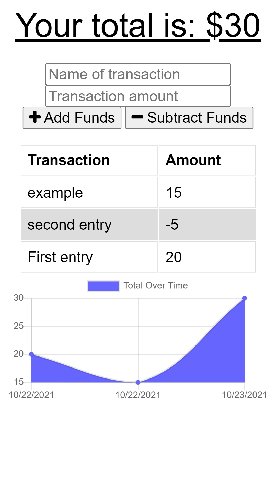

# budget-tracker

## Description 
  This application was created to build a tracker to keep track of expenses. The technologies used to build this app are: express, mongoose, morgan, JavaScript, and node. Upon visiting the APIs the user can either add to the budget by either adding or subtracting funds. This application also allows user to interact with it while there is no internet connection. This allows for ease of use when the network the user has isn't completetly stable.
  
  This application can be found live at the following link.

   https://budget1--tracker.herokuapp.com/

  
  ## Table of Contents
  - [Description](#description)
  - [Installation](#installation)
  - [Usage](#usage)
  - [License](#license)
  - [Questions](#questions)

  ## Installation 
  - Use a Termal or GitBash
   - Install Node
    - "npm -v" to see current version on node
  - Install morgan package
    - npm i morgan
  - Install express package
    - npm i express
  - Install mongoose package 
    - npm i mongoose
  - Use any compatible text editor
  - Clone or fork this repository to desired workstation

  ## Usage 
  Start the application by calling the file npm start in either Terminal or GitBash. From there the user can add or subtract funds along with the name and amount of the transaction. Once the transaction has been recordered it will display a graph showing the transactions with their dates. The total will also display at the top for the user. If there is no internet connection and a transaction has been submitted the application will work as normal and record the transaction once a network has been established.

  
  
  ## License
  - This project is under the [MIT](https://opensource.org/licenses/MIT) license. 

  ## Questions
  - Feel free to reach me via GitHub or Email with any questions regarding this project
  - GitHub: [georgedmendoza](https://github.com/georgedmendoza)
  - Email: [georgedmendoza13@gmail.com](mailto:georgedmendoza13@gmail.com)